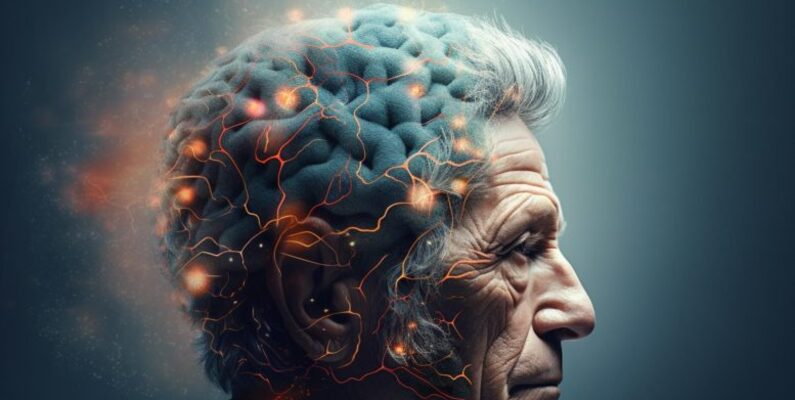
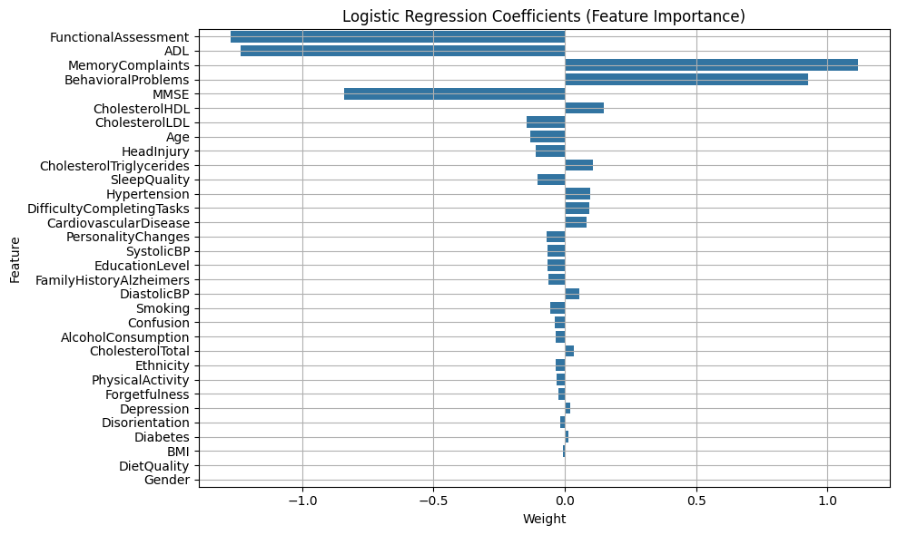
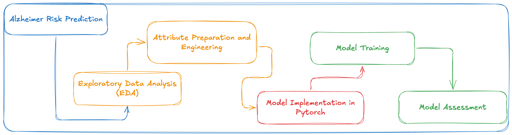
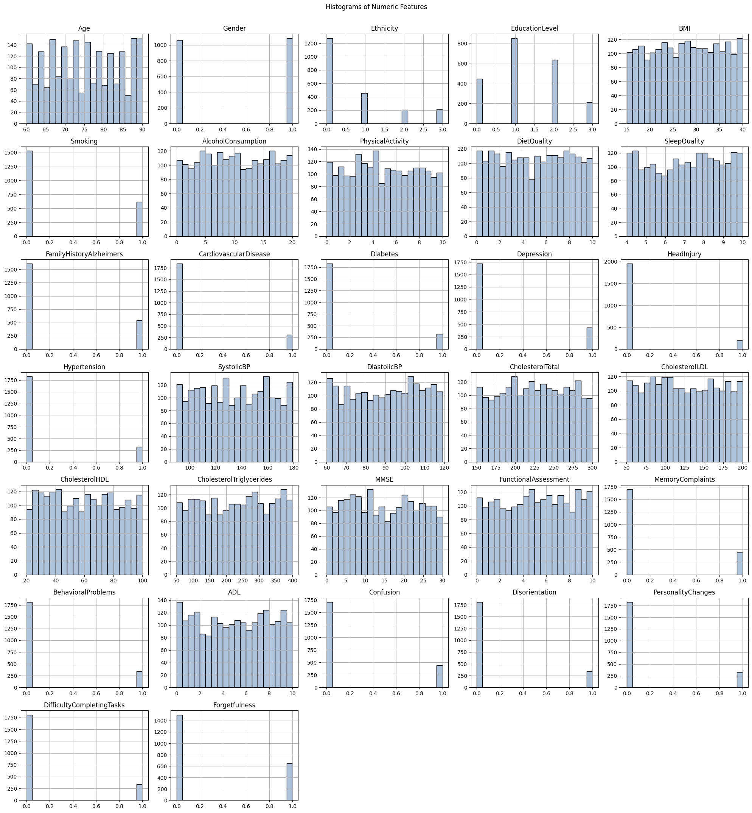
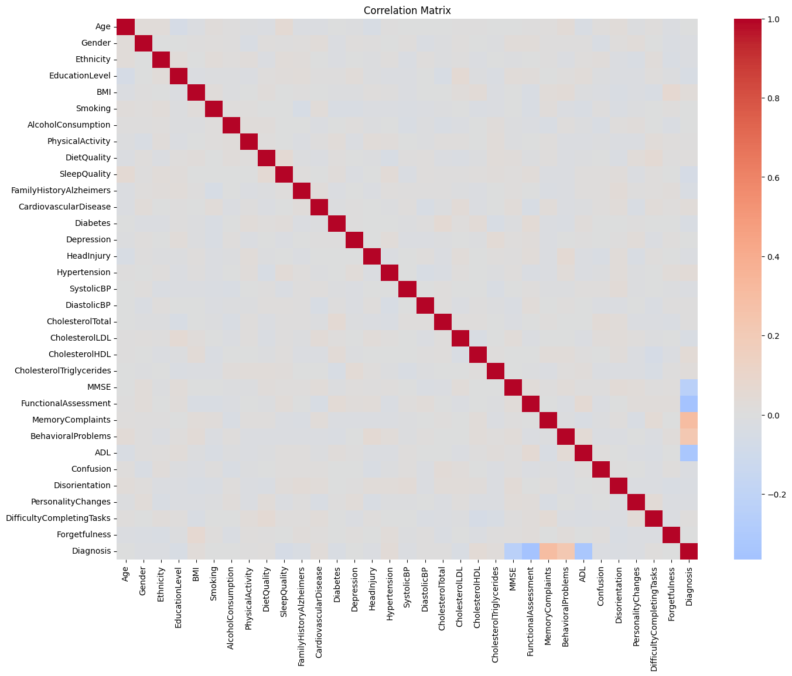
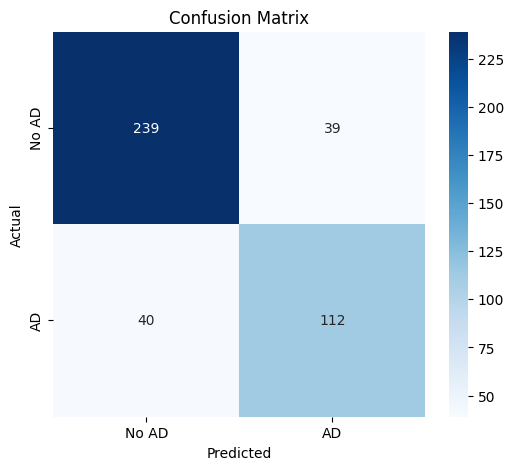

# 🧠 Alzheimer Diagnosis with Machine Learning



## 📌 Project Objective

This project aims to **predict Alzheimer's diagnosis** based on clinical, behavioral, and cognitive data from patients. Using a supervised machine learning approach, we apply a **logistic regression model implemented in PyTorch** to classify patients as either having or not having the disease.

## 🗂️ Data Source

* Dataset: **Alzheimer’s Disease Dataset**
* Source: Kaggle
* Link: [https://www.kaggle.com/datasets/rabieelkharoua/alzheimers-disease-dataset](https://www.kaggle.com/datasets/rabieelkharoua/alzheimers-disease-dataset)

This dataset contains comprehensive health information on 2,149 patients, each uniquely identified by IDs ranging from 4,751 to 6,900. It includes demographic details, lifestyle factors, medical history, clinical measurements, cognitive and functional assessments, symptoms, and Alzheimer’s diagnosis.

### 🆔 Patient Identification

| Variable  | Description                                | Range / Values |
| --------- | ------------------------------------------ | -------------- |
| PatientID | Unique identifier assigned to each patient | 4751 to 6900   |

### 👤 Demographic Details

| Variable       | Description                   | Values / Range                                              |
| -------------- | ----------------------------- | ----------------------------------------------------------- |
| Age            | Patient's age                 | 60 to 90 years                                              |
| Gender         | Gender (0 = Male, 1 = Female) | 0, 1                                                        |
| Ethnicity      | Patient's ethnicity           | 0: Caucasian<br>1: African American<br>2: Asian<br>3: Other |
| EducationLevel | Education level               | 0: None<br>1: High School<br>2: Bachelor's<br>3: Higher     |

### 🧬 Lifestyle Factors

| Variable           | Description                        | Range / Values |
| ------------------ | ---------------------------------- | -------------- |
| BMI                | Body Mass Index                    | 15 to 40       |
| Smoking            | Smoking status (0 = No, 1 = Yes)   | 0, 1           |
| AlcoholConsumption | Weekly alcohol consumption (units) | 0 to 20        |
| PhysicalActivity   | Weekly physical activity (hours)   | 0 to 10        |
| DietQuality        | Diet quality score                 | 0 to 10        |
| SleepQuality       | Sleep quality score                | 4 to 10        |

### 🏥 Medical History

| Variable                | Description                                     | Values |
| ----------------------- | ----------------------------------------------- | ------ |
| FamilyHistoryAlzheimers | Family history of Alzheimer's (0 = No, 1 = Yes) | 0, 1   |
| CardiovascularDisease   | Cardiovascular disease (0 = No, 1 = Yes)        | 0, 1   |
| Diabetes                | Presence of diabetes (0 = No, 1 = Yes)          | 0, 1   |
| Depression              | Presence of depression (0 = No, 1 = Yes)        | 0, 1   |
| HeadInjury              | History of head injury (0 = No, 1 = Yes)        | 0, 1   |
| Hypertension            | Presence of hypertension (0 = No, 1 = Yes)      | 0, 1   |

### 🩺 Clinical Measurements

| Variable                 | Description              | Range (Units)    |
| ------------------------ | ------------------------ | ---------------- |
| SystolicBP               | Systolic blood pressure  | 90 to 180 mmHg   |
| DiastolicBP              | Diastolic blood pressure | 60 to 120 mmHg   |
| CholesterolTotal         | Total cholesterol        | 150 to 300 mg/dL |
| CholesterolLDL           | Low-density lipoprotein  | 50 to 200 mg/dL  |
| CholesterolHDL           | High-density lipoprotein | 20 to 100 mg/dL  |
| CholesterolTriglycerides | Triglycerides level      | 50 to 400 mg/dL  |

### 🧠 Cognitive and Functional Assessments

| Variable             | Description                                          | Range / Values |
| -------------------- | ---------------------------------------------------- | -------------- |
| MMSE                 | Mini-Mental State Exam (lower = more impairment)     | 0 to 30        |
| FunctionalAssessment | Functional score (lower = more impairment)           | 0 to 10        |
| MemoryComplaints     | Memory complaints (0 = No, 1 = Yes)                  | 0, 1           |
| BehavioralProblems   | Behavioral problems (0 = No, 1 = Yes)                | 0, 1           |
| ADL                  | Activities of Daily Living (lower = more impairment) | 0 to 10        |

### 😕 Symptoms

| Variable                  | Description                                   | Values |
| ------------------------- | --------------------------------------------- | ------ |
| Confusion                 | Presence of confusion (0 = No, 1 = Yes)       | 0, 1   |
| Disorientation            | Presence of disorientation (0 = No, 1 = Yes)  | 0, 1   |
| PersonalityChanges        | Personality changes (0 = No, 1 = Yes)         | 0, 1   |
| DifficultyCompletingTasks | Difficulty completing tasks (0 = No, 1 = Yes) | 0, 1   |
| Forgetfulness             | Presence of forgetfulness (0 = No, 1 = Yes)   | 0, 1   |

### 🧾 Diagnosis Information

| Variable  | Description                             | Values |
| --------- | --------------------------------------- | ------ |
| Diagnosis | Alzheimer's diagnosis (0 = No, 1 = Yes) | 0, 1   |

### 🔒 Confidential Information

| Variable       | Description            | Value       |
| -------------- | ---------------------- | ----------- |
| DoctorInCharge | Confidential doctor ID | "XXXConfid" |

---



## 🔍 Project



### 1. **Exploratory Data Analysis (EDA)**

#### 📊 Histograms of Numeric Variables

We used histograms to:

* Understand the **distribution** of each attribute
* Identify **outliers**
* Spot possible **scaling or encoding issues**



#### 🔗 Correlation Matrix

We created a **correlation matrix of numerical attributes** to:

* Detect **linear relationships** between variables
* Identify potential **redundancies**
* Support **feature engineering**



### 2. 🧼 Data Cleaning & Preparation

| Step                      | Description                                                      |
| ------------------------- | ---------------------------------------------------------------- |
| Handling null values      | Removed rows or filled values (e.g., mean for continuous values) |
| Type conversion           | Ensured proper data types (`int`, `float`)                       |
| Dropped useless variables | Removed `PatientID` as it doesn't help model performance         |
| Class encoding            | Converted the `Diagnosis` variable to binary (0 and 1)           |

### 3. ⚙️ Feature Engineering

* **Normalization**: Numeric variables were normalized using `StandardScaler`.
* **Feature selection**: Based on correlation and distribution analysis, we kept only **relevant and non-redundant** variables.
* **Label Encoding**: Converted `Diagnosis` from text to binary labels:

  * `Demented` → `1`
  * `Non-Demented` → `0`

### 🔥 Modeling with PyTorch - Architecture

We used a **`LogisticRegressionModel(nn.Module)` class** with:

* A single linear input-to-output layer (no hidden layers)
* Sigmoid as the activation function

```python
class LogisticRegressionModel(nn.Module):
    def __init__(self, input_dim):
        super(LogisticRegressionModel, self).__init__()
        self.linear = nn.Linear(input_dim, 1)

    def forward(self, x):
        return torch.sigmoid(self.linear(x))
```

### 🧪 Model Training

#### 🔧 Settings

* **Train/test split**: 80% training, 20% testing
* **Batch size**: 32
* **Epochs**: 100
* **Optimizer**: `torch.optim.Adam`
* **Loss function**: `BCELoss()` (Binary Cross Entropy)

> The loss function evaluates the **distance between the model's prediction and the true label**, and **gradients** are backpropagated to adjust model weights.

📌 **Loss function equation:**

$$
\mathcal{L}(y, \hat{y}) = -[y \cdot \log(\hat{y}) + (1 - y) \cdot \log(1 - \hat{y})]
$$

## 📈 Model Evaluation

We used standard binary classification metrics:

| Metric                   | Value  | Description                                       |
| ------------------------ | ------ | ------------------------------------------------- |
| **Accuracy**             | 0.8186 | Percentage of correct predictions                 |
| **Precision**            | 0.7434 | Proportion of true positives among predicted ones |
| **Recall** (Sensitivity) | 0.7434 | Ability to detect true positives                  |
| **F1-Score**             | 0.7434 | Harmonic mean of precision and recall             |

## 📌 Results



The confusion matrix shows solid performance with **81.86% accuracy**. The model correctly identified **112 Alzheimer’s patients** (true positives) and **239 healthy individuals** (true negatives).

However, it produced **40 false negatives** — Alzheimer’s cases that went undetected — which is clinically significant. With a **precision and recall of 74.34%**, the model strikes a fair balance between catching positive cases and avoiding false alarms. Nevertheless, expert clinical evaluation remains essential for final diagnosis.

## 💻 How to Run

1. Clone the repository:

   ```bash
   git clone https://github.com/ernanej/machine-learning-alzheimer-risk-prediction.git
   cd machine-learning-alzheimer-risk-prediction
   ```

2. Install dependencies:

   ```bash
   cd streamlit_app
   python -m venv venv
   pip install -r requirements.txt
   ```

3. Run the Streamlit app:

   ```bash
   streamlit run app.py
   ```

> To generate new training data, change the dataset path and rerun the notebook cells to create `features.pkl`, `logistic_model_weights.pth`, `logistic_model.pkl`, and `scaler.pkl`. Update them in the `/streamlit_app/models` directory and rerun the app.

## 📚 Technologies Used

* Python
* Pandas, NumPy
* PyTorch
* Matplotlib, Seaborn, Plotly
* Streamlit

## 📄 License

MIT License. See the `LICENSE` file for more details.
